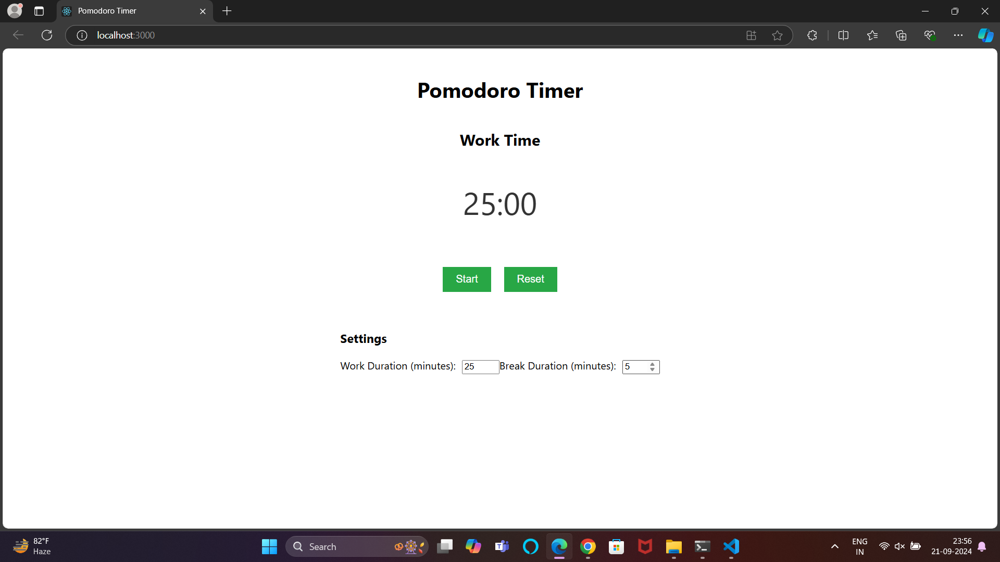

# Pomodoro-Timer
A simple Pomodoro Timer built using React. This app helps users manage their time using the Pomodoro technique, which involves breaking work into intervals (traditionally 25 minutes), separated by short breaks.
 
<h1>Screenshots</h1>

     

